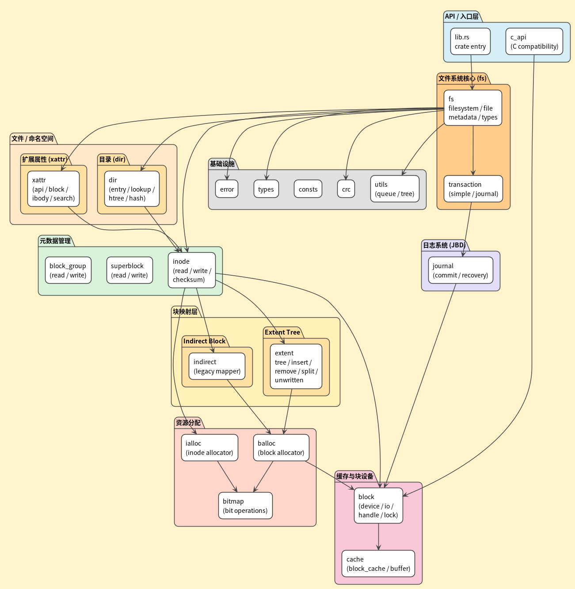

# GalOS

> 基于 StarryOS 开发的增强型操作系统，致力于提供安全、可靠的纯 Rust 实现

**开发团队**：GalOS团队
**学校**：杭州电子科技大学

## 目录

- [项目概述](#项目概述)
- [工程一：纯 Rust EXT4 文件系统](#工程一纯-rust-ext4-文件系统)
  - [背景与动机](#背景与动机)
  - [lwext4_core 项目介绍](#lwext4_core-项目介绍)
  - [开发阶段](#开发阶段)
  - [技术特性](#技术特性)
- [工程二：系统调用完善](#工程二系统调用完善)
  - [工程目标](#工程目标)
  - [新增系统调用](#新增系统调用)
  - [实现细节](#实现细节)
  - [工程价值](#工程价值)
- [项目结构](#项目结构)
- [快速开始](#快速开始)
- [技术栈](#技术栈)
- [许可证](#许可证)
- [相关链接](#相关链接)

---

## 项目概述

**GalOS** 是在 [StarryOS](https://github.com/Starry-OS) 基础上进行开发的增强型操作系统。本项目主要包含两个核心工程：

1. **工程一**：将 StarryOS 的 EXT4 文件系统替换为纯 Rust 实现（lwext4_core）
2. **工程二**：在 StarryOS 基础上丰富系统调用实现，特别是内存管理相关功能

### 项目特色

- **纯 Rust 实现**：充分利用 Rust 语言的内存安全特性
- **生产级质量**：完善的错误处理和详细的代码注释
- **模块化设计**：核心组件可独立发布为 crate 供其他项目使用
- **性能优化**：针对操作系统场景进行专门优化

---

## 工程一：纯 Rust EXT4 文件系统

### 背景与动机

#### 为什么需要 lwext4_core？

原 StarryOS 依赖的 lwext4 项目存在以下问题：

1. **长期未维护**：原 C 语言版本的 lwext4 项目已长期未更新
2. **安全隐患**：C 语言实现存在潜在的内存安全问题
3. **集成困难**：C/Rust 混合编程增加了项目复杂度
4. **严重的文件系统损坏 Bug**：在实际使用中发现会造成文件系统损坏

**实际问题示例**：

原 StarryOS 在运行一段时间后，使用 `tune2fs` 和 `e2fsck` 检查发现：

```
# tune2fs -l disk.img
Filesystem state:         clean with errors
Errors behavior:          Continue
Last mount time:          Thu Jan  1 08:00:08 1970
Last write time:          Thu Jan  1 08:00:08 1970

# e2fsck -f disk.img
e2fsck 1.46.5 (30-Dec-2021)
Pass 1: Checking inodes, blocks, and sizes
Pass 2: Checking directory structure
Pass 3: Checking directory connectivity
Pass 4: Checking reference counts
Pass 5: Checking group summary information
disk.img: 1234/65536 files (0.1% non-contiguous), 12345/262144 blocks
```

### lwext4_core 项目介绍

lwext4_core 是一个**独立的纯 Rust EXT4 文件系统实现**，旨在提供安全、可靠、易用的 EXT4 文件系统服务。

#### 核心优势

| 特性 | 说明 |
|------|------|
| **内存安全** | 利用 Rust 的所有权系统和借用检查器，杜绝内存安全问题 |
| **详细注释** | 为代码添加详尽的中英文注释，便于学习和维护 |
| **易于集成** | 纯 Rust 实现，与 Rust OS 项目（StarryOS、ArceOS）无缝对接 |
| **可扩展性** | 模块化设计，便于日后功能扩展和优化 |
| **独立发布** | 可作为独立 crate 发布，供其他 OS 项目使用 |

#### 项目仓库

- **lwext4_core**：https://github.com/c20h30o2/lwext4_core
- **GalOS（集成项目）**：https://github.com/GalOS-hdu/GalOS

### 开发阶段

项目开发分为四个主要阶段：

```
阶段一：独立开发 lwext4_core
   ├─ 实现核心 EXT4 功能
   ├─ 完善单元测试
   └─ 准备作为独立 crate 发布

阶段二：适配层开发
   ├─ 在 GalOS/arceos 的 ext4 层实现适配
   ├─ 桥接 ArceOS 的 AxBlockDevice 与 lwext4_core 的 BlockDevice
   └─ 实现 VFS 层集成

阶段三：全面测试
   ├─ OS 内部功能测试
   ├─ 性能基准测试
   └─ 稳定性压力测试

阶段四：同步升级
   ├─ 性能优化（多线程支持、缓存优化）
   ├─ 高级功能（Journal、Extent Tree 优化）
   └─ 持续维护与功能扩展
```

### 技术特性

#### 项目规模

- **代码量**：超过 18,000 行纯 Rust 代码
- **注释量**：近 10,000 行详细注释
- **模块数**：18 个核心模块
- **文件数**：96 个源文件
- **依赖**：仅依赖 `log`、`byteorder`、`bitflags`、`crc32fast` 等轻量级 crate

#### 已实现功能

**核心功能**：
- ✅ 完整的 EXT4 磁盘格式支持
- ✅ Extent Tree（支持 grow、insert、remove、split、merge）
- ✅ Indirect Block Mapping（间接块映射）
- ✅ Journal（日志系统 JBD，支持 checkpoint、commit、recovery）
- ✅ Transaction（事务管理，支持 journal 和 simple 两种模式）

**文件系统操作**：
- ✅ 基础文件操作（创建、读写、删除、截断）
- ✅ 目录操作（创建、遍历、删除、查找）
- ✅ 符号链接（Symlink）
- ✅ 硬链接（Hard Link）
- ✅ 扩展属性（xattr，包括 block 和 ibody 存储）

**存储管理**：
- ✅ 块分配与释放（balloc，支持 checksum）
- ✅ Inode 分配与释放（ialloc，支持 checksum）
- ✅ 位图操作（bitmap）
- ✅ 块组管理（block_group，支持 checksum）
- ✅ 超级块管理（superblock，支持 checksum）

**高级特性**：
- ✅ Block Cache（块缓存）
- ✅ Directory Htree（目录哈希树索引）
- ✅ Path Lookup（路径查找优化）
- ✅ CRC32 Checksum（各级元数据校验）
- ✅ C API 兼容层（可选特性）

#### lwext4_core 模块架构

lwext4_core 采用分层模块化设计，从底层块设备到上层文件系统API，共分为9个主要层次：




**各层职责说明**：

| 层次 | 模块 | 主要职责 |
|------|------|----------|
| **应用层 API** | `fs` | 提供文件系统挂载、文件/目录操作等上层API |
| **文件与目录操作层** | `extent`、`indirect`、`dir`、`xattr` | 块映射管理、目录查找、扩展属性 |
| **元数据管理层** | `inode`、`block_group`、`superblock` | Inode读写、块组描述符、超级块管理 |
| **资源分配层** | `balloc`、`ialloc`、`bitmap` | 块/Inode分配释放、位图操作 |
| **事务与日志层** | `transaction`、`journal` | 事务管理、日志记录与恢复 |
| **缓存与块设备层** | `cache`、`block` | LRU缓存、块设备抽象接口 |
| **基础设施层** | `utils`、`consts`、`error`、`types`、`crc` | 工具函数、常量、错误类型、CRC校验 |
| **兼容层** | `c_api` | 提供C语言兼容接口（可选） |

#### 核心模块结构

```
lwext4_core/src/            # 共 18 个模块，96 个源文件
├── balloc/                 # 块分配
│   ├── alloc.rs            # 块分配实现
│   ├── free.rs             # 块释放实现
│   ├── checksum.rs         # 位图校验和
│   └── ...
├── bitmap/                 # 位图操作
│   ├── ops.rs              # 位图基础操作
│   └── mod.rs
├── block/                  # 块设备接口层
│   ├── device.rs           # BlockDevice trait 定义
│   ├── handle.rs           # 块句柄
│   ├── io.rs               # 块 I/O 操作
│   └── ...
├── block_group/            # 块组管理
│   ├── read.rs             # 块组描述符读取
│   ├── write.rs            # 块组描述符写入
│   ├── checksum.rs         # 块组校验和
│   └── mod.rs
├── cache/                  # 缓存层
│   ├── block_cache.rs      # 块缓存实现
│   ├── buffer.rs           # 缓冲区管理
│   └── mod.rs
├── c_api/                  # C API 兼容层
│   ├── block.rs
│   └── mod.rs
├── dir/                    # 目录操作
│   ├── entry.rs            # 目录项
│   ├── iterator.rs         # 目录迭代器
│   ├── lookup.rs           # 目录查找
│   ├── path_lookup.rs      # 路径查找
│   ├── htree.rs            # 哈希树索引
│   ├── hash.rs             # 哈希函数
│   ├── write.rs            # 目录写入
│   ├── checksum.rs         # 目录校验和
│   └── ...
├── extent/                 # Extent Tree 实现
│   ├── tree.rs             # Extent Tree 核心
│   ├── grow.rs             # 树增长
│   ├── insert.rs           # 插入 extent
│   ├── remove.rs           # 移除 extent
│   ├── split.rs            # 分裂节点
│   ├── merge.rs            # 合并节点
│   ├── write.rs            # 写入操作
│   ├── verify.rs           # 树验证
│   ├── checksum.rs         # Extent 校验和
│   └── ...
├── fs/                     # 文件系统核心
│   ├── filesystem.rs       # 文件系统主结构和操作
│   ├── file.rs             # 文件操作
│   ├── inode_ref.rs        # Inode 引用
│   ├── block_group_ref.rs  # 块组引用
│   ├── metadata.rs         # 元数据操作
│   └── types.rs            # 类型定义
├── ialloc/                 # Inode 分配
│   ├── alloc.rs            # Inode 分配实现
│   ├── free.rs             # Inode 释放实现
│   ├── checksum.rs         # Inode 位图校验和
│   └── ...
├── indirect/               # 间接块映射
│   ├── mapper.rs           # 间接块映射器
│   └── mod.rs
├── inode/                  # Inode 管理
│   ├── read.rs             # Inode 读取
│   ├── write.rs            # Inode 写入
│   ├── checksum.rs         # Inode 校验和
│   └── mod.rs
├── journal/                # 日志系统（JBD）
│   ├── jbd_journal.rs      # 日志主结构
│   ├── jbd_trans.rs        # 事务管理
│   ├── jbd_buf.rs          # 日志缓冲
│   ├── jbd_fs.rs           # 文件系统集成
│   ├── commit.rs           # 提交事务
│   ├── checkpoint.rs       # 检查点
│   ├── recovery.rs         # 恢复
│   ├── checksum.rs         # 日志校验和
│   └── types.rs            # 日志类型
├── superblock/             # 超级块管理
│   ├── read.rs             # 超级块读取
│   ├── write.rs            # 超级块写入
│   ├── checksum.rs         # 超级块校验和
│   └── mod.rs
├── transaction/            # 事务管理
│   ├── journal.rs          # Journal 事务
│   ├── simple.rs           # Simple 事务
│   ├── block_handle.rs     # 块句柄
│   └── mod.rs
├── xattr/                  # 扩展属性
│   ├── api.rs              # API 接口
│   ├── block.rs            # 块存储
│   ├── ibody.rs            # Inode body 存储
│   ├── search.rs           # 查找
│   ├── write.rs            # 写入
│   ├── hash.rs             # 哈希
│   └── prefix.rs           # 前缀处理
├── utils/                  # 工具函数
│   ├── queue.rs            # 队列
│   └── tree.rs             # 树结构工具
├── consts.rs               # 常量定义
├── crc.rs                  # CRC 校验
├── error.rs                # 错误类型
├── types.rs                # 全局类型
└── lib.rs                  # 库入口
```

#### 适配层架构

在 GalOS 中的集成路径：`arceos/modules/axfs-ng/src/fs/ext4/`

| 组件 | 文件 | 作用 |
|------|------|------|
| 块设备适配器 | `adapter.rs` | 实现 `lwext4_core::BlockDevice` trait |
| 文件系统包装器 | `wrapper.rs` | 封装 lwext4_core API 供 VFS 使用 |
| Inode 实现 | `inode.rs` | 实现 VFS 的 `NodeOps`、`FileNodeOps`、`DirNodeOps` |
| 工具函数 | `util.rs` | 错误转换、类型转换等辅助函数 |

---

## 工程二：系统调用完善

### 工程目标

工程二旨在进一步增强 GalOS 的系统调用支持，使其更接近 Linux 系统调用规范。主要聚焦于：

1. **完善系统调用接口**，提升与 Linux 的兼容性
2. **增强内存管理功能**，提升系统性能和安全性
3. **确保与 ArceOS 的无缝集成**
4. **保持代码的可维护性和可扩展性**

### 新增系统调用

#### 1. 内存建议系统调用

**`sys_madvise`** - 允许进程向内核提供内存使用模式建议

**支持的建议类型**：
- `MADV_NORMAL` - 默认行为，无特殊处理
- `MADV_RANDOM` - 随机访问模式
- `MADV_SEQUENTIAL` - 顺序访问模式
- `MADV_WILLNEED` - 预加载内存页
- `MADV_DONTNEED` - 标记内存页可回收
- `MADV_REMOVE` - 移除内存页

**函数签名**：
```rust
pub fn sys_madvise(addr: usize, length: usize, advice: u32) -> AxResult<isize>
```

**实现位置**：`api/src/syscall/mm/mmap.rs`

#### 2. 内存同步系统调用

**`sys_msync`** - 将映射的文件页同步到磁盘

**支持的标志**：
- `MS_SYNC` (1) - 同步写入
- `MS_ASYNC` (2) - 异步写入
- `MS_INVALIDATE` (4) - 使其他映射失效

**函数签名**：
```rust
pub fn sys_msync(addr: usize, length: usize, flags: u32) -> AxResult<isize>
```

**实现位置**：`api/src/syscall/mm/mmap.rs`

#### 3. 内存锁定系统调用

**`sys_mlock`** - 锁定内存区域，防止被交换出去

**函数签名**：
```rust
pub fn sys_mlock(addr: usize, length: usize) -> AxResult<isize>
```

**`sys_mlock2`** - 带有额外标志的增强版

**函数签名**：
```rust
pub fn sys_mlock2(addr: usize, length: usize, flags: u32) -> AxResult<isize>
```

**实现位置**：`api/src/syscall/mm/mmap.rs`

#### 4. 文件系统用户 ID 管理

**`sys_setfsuid`** - 设置文件系统用户 ID

**`sys_setfsgid`** - 设置文件系统组 ID

**实现位置**：`api/src/syscall/sys.rs`

### 实现细节

#### 代码组织

```
api/src/syscall/
├── mm/
│   └── mmap.rs          # sys_madvise, sys_msync, sys_mlock, sys_mlock2
├── sys.rs               # sys_setfsuid, sys_setfsgid
├── fs/                  # 文件系统相关系统调用
│   ├── io.rs
│   ├── fd_ops.rs
│   ├── stat.rs
│   └── ...
├── task/                # 进程/线程相关系统调用
│   ├── clone.rs
│   ├── execve.rs
│   └── ...
└── mod.rs               # 系统调用注册和分发
```

#### 系统调用注册示例

在 `api/src/syscall/mod.rs` 中：

```rust
match sysno {
    // ... 其他系统调用
    Sysno::madvise => sys_madvise(uctx.arg0(), uctx.arg1() as _, uctx.arg2() as _),
    Sysno::msync => sys_msync(uctx.arg0(), uctx.arg1(), uctx.arg2() as _),
    Sysno::mlock => sys_mlock(uctx.arg0(), uctx.arg1()),
    Sysno::mlock2 => sys_mlock2(uctx.arg0(), uctx.arg1(), uctx.arg2() as _),
    Sysno::setfsuid => sys_setfsuid(uctx.arg0() as _),
    Sysno::setfsgid => sys_setfsgid(uctx.arg0() as _),
    // ...
}
```

#### 技术特点

- **严格规范遵循**：参数和返回值严格遵循 Linux 系统调用规范
- **类型安全**：利用 Rust 的类型系统减少错误
- **完整错误处理**：所有系统调用都有完整的错误处理机制
- **详细调试信息**：使用 `debug!` 宏记录系统调用参数，便于调试
- **ArceOS 适配**：对 ArceOS 内存管理模块进行相应调整以支持新功能

### 工程价值

| 价值维度 | 说明 |
|----------|------|
| **性能提升** | 通过 `madvise` 和 `mlock` 等系统调用，进程可以更有效地利用内存资源 |
| **功能增强** | 完善的系统调用接口使 GalOS 能够支持更多复杂的应用程序 |
| **安全性** | 通过 `setfsuid` 和 `setfsgid` 等系统调用，增强文件系统安全管理能力 |
| **生态发展** | 更完整的系统调用支持有助于吸引更多开发者基于 GalOS 进行应用开发 |

---

## 项目结构

```
GalOS/
├── api/                 # 系统调用 API 层
│   └── src/
│       └── syscall/     # 系统调用实现
├── arceos/              # ArceOS 核心（子模块）
│   └── modules/
│       └── axfs-ng/     # 文件系统模块
│           └── src/
│               └── fs/
│                   └── ext4/  # EXT4 适配层
├── core/                # 核心库
├── docs/                # 文档
├── logs/                # 测试日志
├── scripts/             # 构建脚本
├── tools/               # 工具集
├── Makefile             # 构建配置
├── Cargo.toml           # Rust 项目配置
└── rootfs-*.img         # 根文件系统镜像
```

### 关键文件说明

| 文件/目录 | 说明 |
|-----------|------|
| `Makefile` | 提供 `make rv`（RISC-V）、`make la`（LoongArch）等快捷命令 |
| `docker-compose.yml` | Docker 开发环境配置（QEMU 10.1.0） |
| `rootfs-riscv64.img` | RISC-V 64 位根文件系统镜像（1GB） |
| `GalOS_riscv64-qemu-virt.elf` | 编译生成的内核 ELF 文件 |
| `api/src/syscall/mm/mmap.rs` | 内存管理系统调用实现 |
| `arceos/modules/axfs-ng/src/fs/ext4/` | EXT4 文件系统适配层 |

---

## 快速开始

### 1. 安装系统依赖

本步骤可能因操作系统而异，以下是基于 Debian/Ubuntu 的示例：

```bash
sudo apt update
sudo apt install -y build-essential cmake clang qemu-system
```

**注意**：在 LoongArch64 上运行需要 QEMU 10+。如果 Linux 发行版中的 QEMU 版本过旧（例如 Ubuntu），请考虑从[源代码](https://www.qemu.org/download/)安装 QEMU。

### 2. 安装 Musl 工具链

1. 从 https://github.com/arceos-org/setup-musl/releases/tag/prebuilt 下载文件
2. 解压到某个路径，例如 `/opt/riscv64-linux-musl-cross`
3. 将 bin 文件夹添加到 `PATH`，例如：
   ```bash
   export PATH=/opt/riscv64-linux-musl-cross/bin:$PATH
   ```

### 3. 克隆仓库

```bash
git clone --recursive https://github.com/Starry-OS/GalOS.git
cd GalOS
```

或者如果已经克隆但没有使用 `--recursive` 选项：

```bash
cd GalOS
git submodule update --init --recursive
```

### 4. 配置 Rust 工具链

```bash
# 从 https://rustup.rs 安装 rustup 或使用系统包管理器

# 确保没有设置 RUSTUP_DIST_SERVER
export RUSTUP_DIST_SERVER=

# 通过 rustup 自动下载组件
cd GalOS
rustup target list --installed
```

### 5. 构建

```bash
# 默认目标：riscv64
make build

# 指定目标架构
make ARCH=riscv64 build
make ARCH=loongarch64 build
```

这也会下载所需的二进制依赖，如 [cargo-binutils](https://github.com/rust-embedded/cargo-binutils)。

### 6. 准备根文件系统

```bash
make img
make img ARCH=riscv64
make img ARCH=loongarch64
```

这将从 [GitHub Releases](https://github.com/Starry-OS/GalOS/releases) 下载根文件系统镜像并设置用于在 QEMU 上运行的磁盘文件。

### 7. 在 QEMU 上运行

```bash
make run ARCH=riscv64
make run ARCH=loongarch64

# 快捷方式：
make rv
make la
```

**注意**：
1. 运行前不必重新执行构建步骤。`run` 会自动重新构建。
2. 磁盘文件在每次运行之间**不会**重置。因此，如果要切换到另一个架构，必须在运行 `make run` 之前使用新架构运行 `make img`。

### 8. 测试文件系统功能

进入 QEMU 后，可以测试以下功能：

```bash
# 基础文件操作
echo "Hello, GalOS!" > test.txt
cat test.txt
mkdir testdir
ls -la

# 包管理器测试
apk update
apk add nano
nano test.txt

# 符号链接测试
ln -s test.txt link.txt
ls -l link.txt
```

---

## 技术栈

### 核心技术

- **语言**：Rust（Nightly）
- **内核架构**：基于 ArceOS 模块化内核
- **文件系统**：lwext4_core（纯 Rust EXT4 实现）
- **构建系统**：Cargo + Make
- **虚拟化**：QEMU 10.1.0

### 支持的架构

| 架构 | 状态 | 说明 |
|------|------|------|
| RISC-V 64 | ✅ 完全支持 | 主要开发和测试平台 |
| LoongArch64 | ✅ 完全支持 | 需要 QEMU 10+ |

### 依赖的关键 Crate

- `axfeat` - ArceOS 功能配置
- `axfs-ng` - 下一代文件系统抽象层
- `axmm` - 内存管理
- `axtask` - 任务管理
- `axdriver` - 设备驱动抽象
- `lwext4_core` - EXT4 文件系统核心（自研）

---

## 下一步

您可以查看 [GUI 指南](./docs/gui.md) 以设置图形环境，或探索此文件夹中的其他文档。

如果您有兴趣为项目做出贡献，请参阅我们的[贡献指南](./CONTRIBUTING.md)。

详细的项目文档请查看：
- [GalOS 项目工程一详细介绍](./GalOS项目工程一.md)
- [GalOS 项目工程二详细介绍](./GalOS项目工程二.md)

---

## 许可证

本项目采用 **Apache License 2.0** 许可证发布。所有修改和新贡献均采用相同许可证。详见 [LICENSE](./LICENSE) 和 [NOTICE](./NOTICE) 文件。

---

## 相关链接

- **GalOS 仓库**：https://github.com/GalOS-hdu/GalOS
- **lwext4_core 仓库**：https://github.com/c20h30o2/lwext4_core
- **ArceOS 项目**：https://github.com/GalOS-hdu/arceos
- **StarryOS 项目**：https://github.com/Starry-OS
